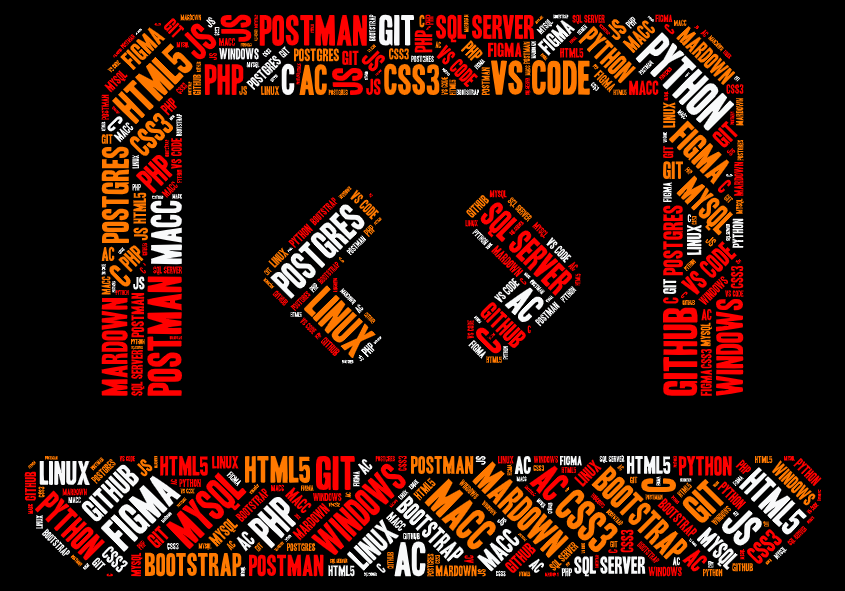

<h1 align="center">Hola, soy Moisés Alejandro </h1>

  🇧🇴 Bolivia &nbsp;•&nbsp; 💻 Software Developer &nbsp;•&nbsp; 🎮 Game Development

 
<h3>👨🏻‍💻 &nbsp;Más sobre mí</h3>

Hola, soy Moisés, estudiante de Ingeniería de Sistemas Informáticos en la Universidad del Valle (Univalle), 🇧🇴 Bolivia.
  

💡 &nbsp;Me gusta explorar nuevas tecnologías, crear soluciones de software y experimentar con ideas que puedan convertirse en proyectos.
 
🎓 &nbsp;Actualmente estoy explorando el mundo de los Autómatas Celulares.
 
🌱 &nbsp;Me encanta la personalización y el diseño, porque creo que cada proyecto debería tener su propio sello.
 
🎮 &nbsp;También me interesa el desarrollo de videojuegos y la creación de experiencias interactivas.
 
✍️ &nbsp;Uno de mis objetivos es abrir un canal de YouTube para compartir lo que voy aprendiendo.

<h3>Tecnologias</h3>

&nbsp;
&nbsp;
&nbsp;
&nbsp;
&nbsp;
&nbsp;
&nbsp;
&nbsp;
&nbsp;
&nbsp;
&nbsp;

<h3>Bases de datos</h3>

&nbsp;
&nbsp;

<h3>Control de versiones y herramientas</h3>

&nbsp;
&nbsp;
&nbsp;
&nbsp;
&nbsp;

&nbsp;
&nbsp;
&nbsp;
&nbsp;
&nbsp;
&nbsp;
&nbsp;
&nbsp;
&nbsp;
&nbsp;

<h3>⚙️Analisis de GitHub</h3>

<h3>Mis proyectos</h3>

 
<h3>Mis Insignias</h3>

